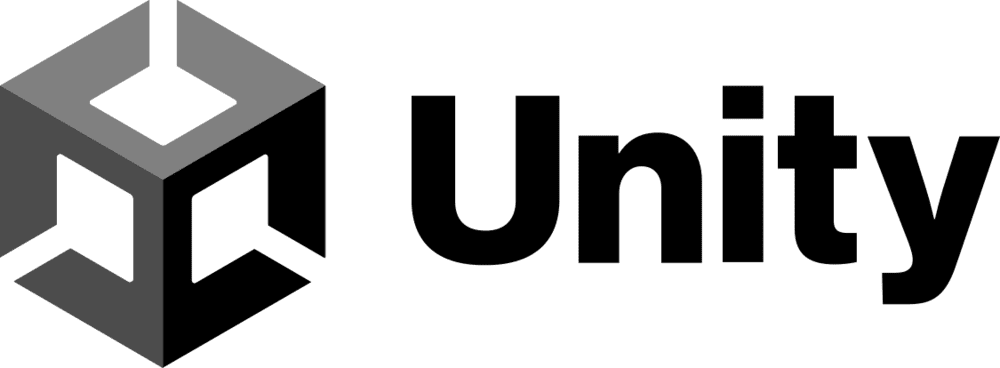

# 👑 King`s Tree 🌳

-------------------

## Personalizaciones:

El tablero base de [Roll a Ball](https://learn.unity.com/project/roll-a-ball) nos ofrece un pequeño 
tablero cuadrado con muros en su perímetro en el que una bola se desplaza por él recogiendo monedas 
que estan esparcidas por el suelo. Mis personalizaciones a partir de ahí son las siguientes:

* Una rampa en el interior de los límites del tablero base.
* 

--------------------

## Interacciones:

------------------

## Jugabilidad y funcionamiento:

